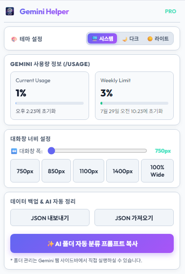
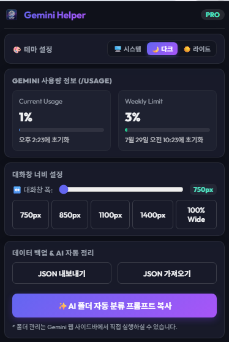

# 🚀 Gemini Extension (제미나이 폴더 및 사용량 헬퍼)

> **Google Gemini(제미나이) 사용자 경험을 극대화하는 올인원 크롬 확장 프로그램**  
> 대화 폴더 정리부터 실시간 사용량 트래킹, 0초 마크다운/JSON 내보내기, 테마 & 채팅 폭 컨트롤까지 하나의 확장 프로그램으로 해결하세요!

---

## 🌟 주요 기능 (Key Features)

### 📂 1. 대화 폴더 관리 및 Chrome Sync 동기화
- **스마트 폴더 정리**: 수많은 Gemini 대화를 주제별(업무, 공부, 프로젝트 등) 폴더로 분류하고 관리할 수 있습니다.
- **Chrome Sync 연동**: 크롬 계정에 자동으로 동기화되어 어느 PC에서나 동일한 폴더 구조를 유지합니다.

### 📊 2. 실시간 Gemini 사용량 트래커 (Floating Widget)
- **실시간 리밋 추적**: `Plan` 정보, 현재 사용량(`Current Usage %`), 주간 한도(`Weekly Limit %`), 리셋 남은 시간을 실시간으로 계산하여 보여줍니다.
- **드래그 가능한 플로팅 캡슐**: 화면 원하는 위치로 자유롭게 드래그하여 배치할 수 있으며, 질문 입력 시 자동으로 사용량이 최신화됩니다.

### ⚡ 3. Instant 0초 대화 내보내기 (Export)
- **`[ MD ]` 마크다운 내보내기**: 답변과 코드 블록을 깔끔한 `.md` 파일로 0초 만에 추출하여 저장합니다.
- **`[ JSON ]` 구조 데이터 내보내기**: 대화 타임스탬프, 질문자 정보, AI 답변 데이터 전체를 표준 JSON 구조로 즉시 다운로드합니다.
- **테마 자동 맞춤**: 라이트/다크 모드에 따라 하얀색 슬레이트 캡슐 또는 네온 캡슐 뱃지로 자동 전환됩니다.

### 🎨 4. 테마 동기화 & 대화창 폭 조절 (Chat Width Control)
- **완벽한 테마 연동**: `시스템 설정(System)`, `다크 모드(Dark)`, `라이트 모드(Light)` 선택을 지원하며 확장 팝업 및 Gemini 화면 전체에 실시간 적용됩니다.
- **채팅 폭 조절 슬라이더**: 대화창 가로 폭(750px ~ 100% Wide)을 자유롭게 조절하여 시원한 대화 화면을 구성합니다. (가상 스크롤 튕김 및 스크롤 버그 원천 방지)

---

## 📸 스크린샷 (Screenshots)

| 폴더 관리 및 사용량 트래커 | 대화 내보내기 캡슐 |
|:---:|:---:|
|  |  |

---

## 💻 설치 및 실행 방법 (Installation)

### 1. 개발자 모드로 로컬 설치 (Load Unpacked)
1. 이 저장소를 클론(Clone)하거나 ZIP으로 다운로드합니다.
   ```bash
   git clone https://github.com/your-username/gemini-extension.git
   ```
2. Chrome 브라우저를 열고 `chrome://extensions/` 주소로 이동합니다.
3. 우측 상단의 **`개발자 모드`** 토글 스위치를 키세요.
4. 좌측 상단의 **`압축해제된 확장 프로그램을 로드합니다`** 버튼을 누른 후, 이 프로젝트 디렉토리를 선택합니다.
5. Google Gemini (`https://gemini.google.com/`)에 접속하여 편리해진 확장 기능들을 사용하세요!

---

## 🛠️ 기술 스택 (Tech Stack)

- **Platform**: Chrome Extension Manifest V3
- **Frontend**: Vanilla HTML5, Modern CSS3 (CSS Variables, Dynamic Brightness Detection), JavaScript (ES6+)
- **Libraries**: TurndownService (Markdown Converter), Chrome Storage Sync API
- **Architecture**: Content Scripts, Background Service Worker, Chrome Messaging Bus

---

## 📄 라이선스 (License)

This project is licensed under the MIT License.
